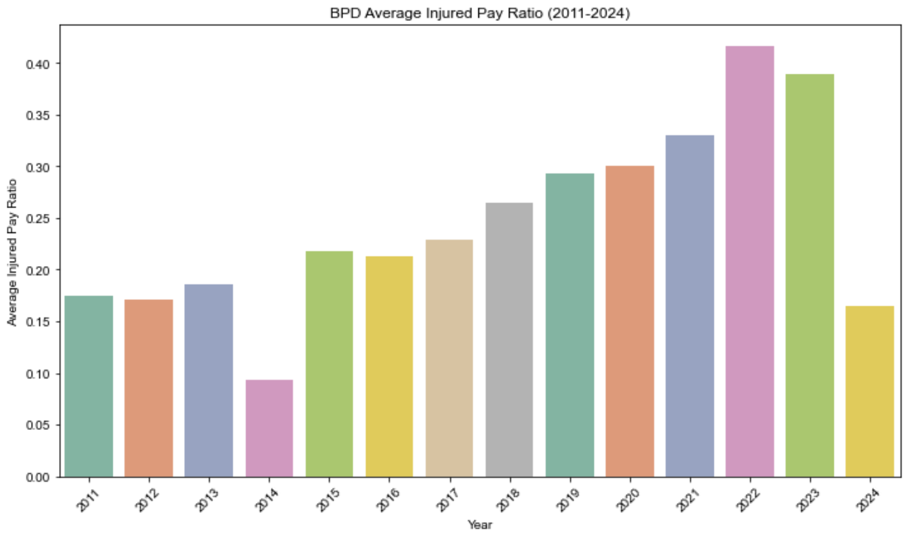
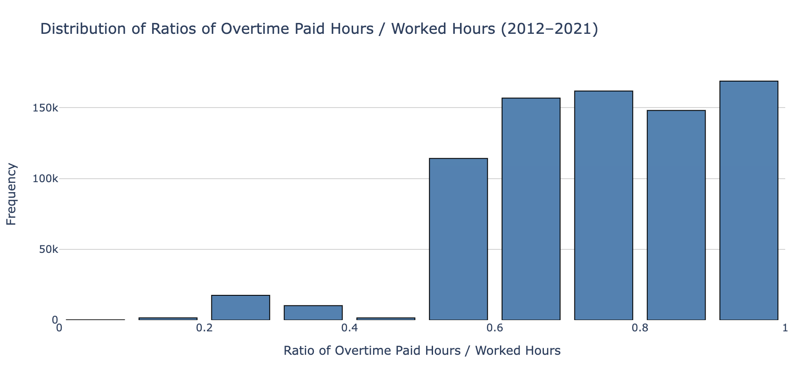

# Midterm Report

> Midterm Presentation Link: https://youtu.be/LUZrgBl8O8Y

## Install Dependencies

```
pip install -r requirements.txt
```


## **Project Description**

The project aims to conduct a thorough analysis of the Boston Police Department (BPD)’s budget. Given the significant operating budget of over $4.6 billion allocated to the BPD, understanding how funds are spent, particularly in the context of overtime, is crucial for ensuring accountability and transparency. The project will involve cleaning, analyzing, and visualizing overtime data to answer key questions regarding shifts in budget, patterns in overtime pay, and potential inequities within the department.

## **Clear Goals**
1. Analyze how the BPD budget has changed in 2011-2024, and identify trends in funding growth or shrinkage across departments.
2. Analyze patterns in overtime pay, comparing it to regular pay and against non-BPD city employees.
3. Use previous overtime data in 2011-2024 to predict overtime pay for the upcoming year, and compare it to the allocated budget.
4. Determine how much of BPD’s total payroll comes from injury pay and the percentage of officers receiving it annually.
5. Track annual financial trends of overtime hours paid compared to overtime hours worked and any discrimination in that trend.
6. Determine whether specific demographics (e.g., senior, male, high-ranking, long-tenured officers) are more likely to have lower worked-to-paid overtime ratios.
7. Analyze the distribution of overtime worked versus paid ratios and identify outliers.

## **Dataset Collection**
The following datasets are collected and utilized:

**Earnings**: Employee Earnings Report dataset (2011-2024). Each year, the City of Boston publishes payroll data for employees. This dataset contains employee names, department names, job details, and earnings information including base salary, overtime, and total earnings, etc.

**Budget**: The FY25 Adopted Operating Budget totals \$4.64 billion and represents an increase of \$345 million, or 8.0%, over FY24. The adopted version reflects the finalized budget accepted by the City Council. The City's budget is planned and built on the program level for each department. This dataset contains expense categories of appropriations to each department and program from the City's General Fund for the year starting July 1, 2024 and ending June 30, 2025.

**Overtime**:Overtime dataset(2012-2020). This dataset contains employee rank, employee hours worked,  employee hours paid and etc.

## **Data Modeling:**
Linear model: Using the scikit-learn library, a linear model was developed to forecast overtime pay trends across various departments. Despite the model's current simplicity, it is projected that overtime pay will continue to increase.

## **Data Processing:**
**Tools**: Pandas, Re, Numpy

For the Earning dataset in the CSV file, many data fields need to be standardized. For example, remove the dollar sign ($) from salary values, unify the representation of missing values in the table, and use Pandas for format conversion, such as applying regular expressions for batch processing. 

Handle outliers by replacing them with the mean or mode, perform data type conversions (e.g., converting between date formats and integers), and convert string data to floating-point numbers to facilitate computation.


## **Data Visualization:**

**Tools**: Matplotlib, Seaborn

1. **Line plot**: We used line plots to visualize the change of BPD paycheck and changes of ratios of overtime paid hours. (See the section below for details).

   It is also used to visualize the trend of the overtime pay for several departments. And the show the result of the preliminary result of the linear model of question3.

2. **Box plot**: We used box plot to visualize the distribution of Overtime Worked/Paid Ratio and Injured Pay ratio. It can help us analyze spread, central tendency and outliers of the data.Also it can help us compare difference between groups of data.

   

   We also use it to visualize the distribution of Overtime Worked/Paid Ratio in 2020,    which can help us to find the outlier in these dataset-values that are significantly higher or lower than the rest of the data.

   

3. **Bar plot**: We used bar plot to show comparisons between different categories like the budget by expense category and earnings of different job titles.
    It is also used to visualize the earnings differences between ranks within the same department.(See the section below for details)


## **Preliminary Result**
1. **How has the BPD budget changed year-over-year?** 

  To identify where there was financial excess in BPD spending we first looked at how the BPD budget had changed year over year. We looked at data from 2022-2025 as this was available to us from the City Of Boston. The overall budget was broken up into seven categories: Contractual Services, Current Charges & Obligation, Equipment, Fixed Expenses, Other Expenses, Personnel Services, and Supplies and Materials. To determine how the budget has changed between these categories, we looked at the percent each category made up of the total budget.From the graph, it is evident that Personnel Services consistently accounted for the largest portion of the total budget across all fiscal years from 2022 to 2025. This category highlights the significant costs associated with salaries and benefits, which dominate the overall spending. Year over year, while other categories such as Contractual Services, Current Charges & Obligations, and Supplies & Materials show relatively minimal changes in their share of the budget, the increasing trend in Other Expenses and Fixed Expenses suggests growing commitments or new initiatives that demanded additional funding. Notably, Equipment and Supplies & Materials remain the smallest contributors to the budget each year, indicating these areas are less prioritized. Despite these being essential for operations, their consistent low allocation reflects that BPD likely focuses resources on personnel-related and operational necessities rather than physical assets or materials. By 2025, the overall budget shows a consistent increase compared to previous years, with the largest growth occurring in Personnel Services and Other Expenses. This trend points to potential financial excess in staffing costs and operational overhead.


  Analyzing the top ten highest-earning police department occupations from 2020 to 2024 reveals that Policy Officer consistently holds the top spot in total income. This is unsurprising, given the large proportion of officers in this role. Almost all occupations experienced relatively stable earnings from 2020 to 2023, with an increase in 2024, likely reflecting the increased Total Budget shown in the figure above.


  Lastly we looked at the changes in funding between departments. To do this we looked at earnings data from 2012-2022. From this we were able to see which departments received the highest salaries and therefore the most budget for that category, focusing on the top 10 departments.As the image shows, the police department has consistently been the highest-earning department between 2020 and 2024, with a significant increase in 2024. While other departments have remained relatively stable, this suggests a budget increase for the police department in 2024.


2. **How have BPD paychecks changed year-over-year? Both the average amount, as compared with non-BPD Boston city.**

#### Assumptions

1. Only non-BPD departments that **exist in all years** from 2011 to 2024 are included in the comparison.
2. Among those non-BPD departments, only the **top 10 by employee count** are selected.
3. Average gross pay is calculated using the **mean of TOTAL_GROSS** per department per year.


#### Observations

This chart shows that all non-BPD departments except Boston Fire Department (BPD)—including Human Resources, City Council, Libraries, Youth Services, and Budget Management—consistently earn much lower average pay than BPD and BFD, generally between \$40,000 and \$90,000.

* BFD leads in pay across almost all years. The Boston Fire Department consistently has the highest average gross pay from 2011 to 2024, except for 2017, where BPD briefly overtook it. In 2024, the BFD average salary exceeds $180,000, maintaining its top position despite BPD’s rapid growth.
* BPD is a strong second, with a sharp spike in 2024. Despite this surge, BPD still remains second to BFD in 2024, but the gap narrows significantly.
* In 2024, both BPD and BFD experienced substantial spikes in average gross pay, likely due to a combination of new collective bargaining agreements, increased overtime from high-profile events (e.g., the Emerson College protests), and retroactive pay. For BPD, this [retroactive compensation](https://www.wbur.org/news/2025/03/12/boston-police-salaries-city-employee#:~:text=In%20Boston%2C%20the,2024%27s%20pay) stemmed from a newly ratified five-year contract that covered wages dating back to 2020, while BFD’s increase followed a similar contract adjustment retroactive to 2021. These factors collectively contributed to sharp year-over-year earnings growth, particularly among frontline public safety personnel.

3. **Given previous overtime data, predict the amount of overtime paid for the next year. How does this compare with the budget allocation for the BPD?**

  The original dataset has mixed data type and some of the data types are “Object”, which is not suitable for further computation. So, current focus on date preprocessing, such as data cleaning and data type correction. Preliminary results are achieved by a simple linear model regardless of the department. Current model can only predict the trade due to a poor R^2 score. 


4. **How much BPD officer pay came from injury pay? What percentage of officers took injury pay in a given year?**  

#### Assumptions

1. Officers with non-null “Injured” pay values are considered to have received injury compensation.
2. The injury pay ratio is defined as: (Injury Pay) / (Total Gross) per officer.
3. Average injury pay ratios are computed on a per-year basis.
4. The proportion of injured officers each year is: (Number of officers with injury pay) / (Total number of officers that year).




#### Observations

The charts show the percentage of total gross pay that came from injury compensation for BPD officers and the percentage of BPD officers who received injury pay each year from 2011 to 2024. On average, around 17% of BPD officers received injury compensation annually. The data reveals significant spikes in the injury rate among Boston Police Department (BPD) officers in the years 2014, 2020, 2021, and 2024. These spikes are accompanied by notable fluctuations in the injury pay ratio—sharp increases in 2020–2022 and notably low ratios in 2014 and 2024

- In 2014, the percentage of injured officers spiked to over 25%, while the injury pay ratio remained unusually low. In this year, national protests following the deaths of [Michael Brown](https://en.wikipedia.org/wiki/Killing_of_Michael_Brown) and [Eric Garner](https://en.wikipedia.org/wiki/Killing_of_Eric_Garner) led to large-scale demonstrations in Boston. This suggests that a large number of officers may received minor injury compensation during large-scale public protests, which could explain the low injury pay ratio. 
- In 2020 and 2021, both injury participation and average injury pay ratio increased significantly, likely due to the [George Floyd protests in Boston](https://en.wikipedia.org/wiki/George_Floyd_protests_in_Massachusetts) and continued pandemic-related stress and enforcement duties. A [high-risk standoff in Dorchester](https://www.wgbh.org/news/politics/2021-11-11/wu-calls-tuesdays-police-shooting-an-example-of-large-systemic-failure?utm_source=chatgpt.com) also contributed to officer injuries in 2021. 
- Most recently, in 2024, the proportion of injured officers reached a record high (over 30%), but the average injury pay ratio dropped sharply.  This suggests widespread but minor injuries, likely associated with the [pro-Palestinian encampment removal at Emerson College](https://www.wcvb.com/article/boston-police-arrest-protesters-clear-pro-palestinian-encampment-at-emerson-college/60600586?utm_source=chatgpt.com), where over 100 arrests were made and several officers were hurt. 

These observations suggest that surges in injury rates may be closely tied to periods of civil unrest and intense policing demands.

5. **How do overtime hours paid compare to overtime hours worked? What does the discrepancy financially amount to, year after year?**
    Due to lack of gender or race information, this question is postponed.

6. **Are certain officers (e.g., white, old, male, long tenure, high ranking title) more likely than others to have lower worked-to-paid ratios?** 

   

  Since we lack certain demographic and employment details for some officers—such as race, age, and tenure—this analysis focuses specifically on the relationship between rank and worked-to-paid overtime ratios.The data suggests a clear trend: higher-ranking officers tend to have lower worked-to-paid overtime ratios. In other words, they are typically paid for significantly more overtime hours than they report working.As shown in the chart, officers with higher ranks (e.g., 8 and 9) have the lowest average ratios, while those with lower ranks (e.g., 3 and 4) show higher ratios, indicating that their reported worked hours are more closely aligned with the overtime hours paid.In conclusion, officers with higher-ranking titles appear more likely to receive overtime pay disproportionate to their reported work hours, highlighting potential disparities in how overtime is allocated or documented across ranks.

7. **What is the distribution of ratios of overtime worked vs. overtime paid? Are there any outliers? (Hours Worked/WRKDHRS vs Hours Paid/OTHOURS in the court OT database).**

   

  The distribution of the ratios of overtime paid hours to court worked hours is right-skewed, with a large number of observations clustered at lower ratios (0.1 to 0.3). And there are smaller peaks near 0.5 and 0.95–1.0, indicating some officers are being paid overtime that closely aligns with, or nearly equals, the number of hours worked.

  The worked-to-paid ratio has shown a consistent decline from 2014 to 2020, dropping from about 0.55 to 0.37. This trend indicates that over time, employees are being paid for more overtime hours than they report working on average. The drop between 2018 and 2020 is especially sharp, which may point to policy shifts, systemic inefficiencies, or underreporting of actual hours worked.

  For the question of are there any outliers, since the drop in 2020 is significantly larger than the gradual changes observed in previous years.
We draw the box plot of 2020 data and set the threshold to 0.1, as we believe extremely low ratio values may be skewing the mean distribution in 2020.


  The outliers are shown in the following figure, which are lower than 0.1.


